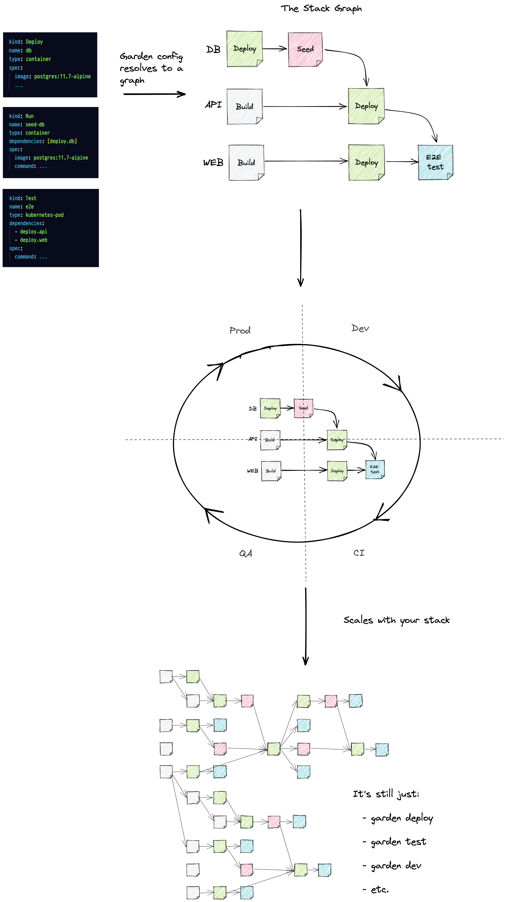

<p align="center">
  
</p>
<div align="center">
  <a href="https://docs.garden.io/basics/5-min-quickstart/?utm_source=github">Quickstart</a>
  <span>&nbsp;&nbsp;•&nbsp;&nbsp;</span>
  <a href="https://garden.io/?utm_source=github">Website</a>
  <span>&nbsp;&nbsp;•&nbsp;&nbsp;</span>
  <a href="https://docs.garden.io/?utm_source=github">Docs</a>
  <span>&nbsp;&nbsp;•&nbsp;&nbsp;</span>
  <a href="https://github.com/garden-io/garden/tree/0.12.50/examples">Examples</a>
  <span>&nbsp;&nbsp;•&nbsp;&nbsp;</span>
  <a href="https://garden.io/blog/?utm_source=github">Blog</a>
  <span>&nbsp;&nbsp;•&nbsp;&nbsp;</span>
  <a href="https://discord.gg/gxeuDgp6Xt">Discord</a>
</div>

### **What is Garden?**

Garden combines rapid development, testing, and DevOps automation in one tool.

It creates realistic cloud-native environments for every stage of software delivery, so you never have to worry about the difference between dev, CI and prod again.

It is DevOps automation with a hyper focus on the inner loop developer experience, built from sound first principles.

With Garden you can:

- **Codify your workflows** across all stages of software delivery—restoring sanity to your process.
- **Develop faster** in production-like environments with live reloading.
- **Ship with confidence** because writing end-to-end tests is a breeze when using Garden.
- **Reduce lead time** thanks to smart caching that dramatically speeds up every step of the process.

This is the repo for the open source Garden Core. To learn more about Garden Cloud [click here](https://cloud.docs.garden.io/).

_If you’re using Garden or if you like the project, please ★ star this repository to show your support 💖_

### **Getting started**

The fastest way to get started with Garden is by following our [quickstart guide](https://docs.garden.io/basics/quickstart).

### **Who should use Garden?**

Garden is most commonly used by teams developing apps that run on Kubernetes. It **leverages your existing infrastructure along with your Kubernetes manifests, Helm charts and Dockerfiles** to simplify and speed up all stages of delivery.

If you can relate to any of these pains, Garden might be the tool for your team:

- Developers can’t run the full set of tests during development and are stuck in an endless loop of git-push-and-wait–for-CI.
- Development environments look nothing like production, causing bugs when features ship.
- Just starting a developer environment is a slow and tedious process and onboarding new developers takes days (or weeks?).
- Your CI pipelines feel like Rube Goldberg machines, taped together with bash scripts.
- Config is duplicated and drifting.
- End-to-end tests are missing because writing and debugging them is too complex.
- Preview environments are missing because spinning them up is too slow and/or complex.
- Each new component in your stack adds more friction and complexity.
- The entire software delivery process is complex, brittle and slow, and people are frustrated.

Getting started with Garden requires some knowledge about how your project is run in production. That’s why it’s usually the DevOps engineer on the team (or someone in a similar role) that first sets things up.

Afterwards, the entire team benefits:

- Developers use Garden for day-to-day development and testing—and the developer experience is bar none!
- DevOps engineers are back in control of their stack.
- Pipeline sanity has been restored and CI is orders of magnitude faster thanks to smart caching.

### **How does it work?**

Garden Core is a standalone binary that can run from CI or from a developer’s machine. It allows you to codify a complete description of your stack, including how it's built, deployed and tested, using the [Stack Graph](https://docs.garden.io/basics/stack-graph)—making your workflows **reproducible and portable**.

With the Stack Graph, each part of your stack describes itself using simple, intuitive YAML declarations, without changing any of your existing code. Garden collects all of your declarations—even across multiple repositories—into a full graph of your stack.



Garden then leverages your _existing tools and infrastructure_ to execute this graph, allowing you to go **from zero to a running system in a single command**. And thanks to smart caching, it’s fast!

For example, to create a preview environment on every pull request, simply add the following to your CI pipeline:

```console
garden deploy --env preview
```

Or, say a developer wants to run an end-to-end test from their laptop as they code. Again, it’s simple:

```console
garden test --name <name-of-your-e2e-test-suite>
```

Garden also has a special mode called “dev mode” which live reloads changes to your running services—ensuring **blazing fast feedback while developing**. To enable it, simply run:

```console
garden dev
```

The Stack Graph is pluggable so how these actions are actually executed depends on the plugins used. Our Kubernetes plugin is currently the most popular, and chances are that’s what you’re here for. To learn more about how Garden works with Kubernetes, check out:

- [Kubernetes Plugins documentation](https://docs.garden.io/guides/remote-kubernetes).

And for a deeper dive on how Garden works in general, we recommend:

- [This guide on how Garden works](https://docs.garden.io/basics/how-garden-works).
- [This video series on the Stack Graph and getting started with Garden](https://www.youtube.com/watch?app=desktop&v=3gMJWGV0WE8).

### **Plugins**

Garden is pluggable by design and supports a variety of providers and module types. Currently, our Kubernetes and Terraform plugins are the most used.

We will be adding more over time, as well as releasing a Plugin SDK (exact timeline TBD) which will allow the community to maintain their own Garden plugins.

The sky’s the limit, but to name some examples:

- Plugins for serverless runtimes will allow users to mix and match platforms in the same project.
- Security plugins that benefit from Garden’s caching and only run time-consuming scans when needed.
- Language-specific plugins for streamlining workflows.

### **Design principles and philosophy**

Below are our guiding principles for developing Garden.

- Garden should work with your existing tools.
- Plugins should automate as much of the standard use cases as possible. Friction is a kill-joy.
- Actions should execute in production-like environments. There’s generally a trade-off between realism and speed of feedback—Garden aims to provide both.
- Garden should err on being too informative. (We’ve gotten a lot of great feedback on this topic and are working hard to improve.)

### **Community**

Join our [Discord community](https://discord.gg/gxeuDgp6Xt) to ask questions, give feedback or just say hi 🙂

### **Security**

If you find a security issue in Garden, please follow responsible disclosure practices and send information about security issues directly to security@garden.io.

For more details [see here](https://github.com/garden-io/garden/blob/main/SECURITY.md).

### **Telemetry**

We are trying to make Garden the best tool possible, and data on how it’s being used is very useful for us to inform the future development of Garden.

When you use Garden, we collect information about the commands you run, the tasks being executed, the project and operating system. We care about your privacy and we take special care to anonymize all the information. For example, we hash module names, and use randomly generated IDs to identify projects.

If you are curious to see an example of the data we collect or if you would like to update your preference, please visit the [Telemetry](https://docs.garden.io/misc/telemetry) page.

### **License**

Garden is licensed according to [Mozilla Public License 2.0 (MPL-2.0)](https://github.com/garden-io/garden/blob/main/LICENSE.md).
