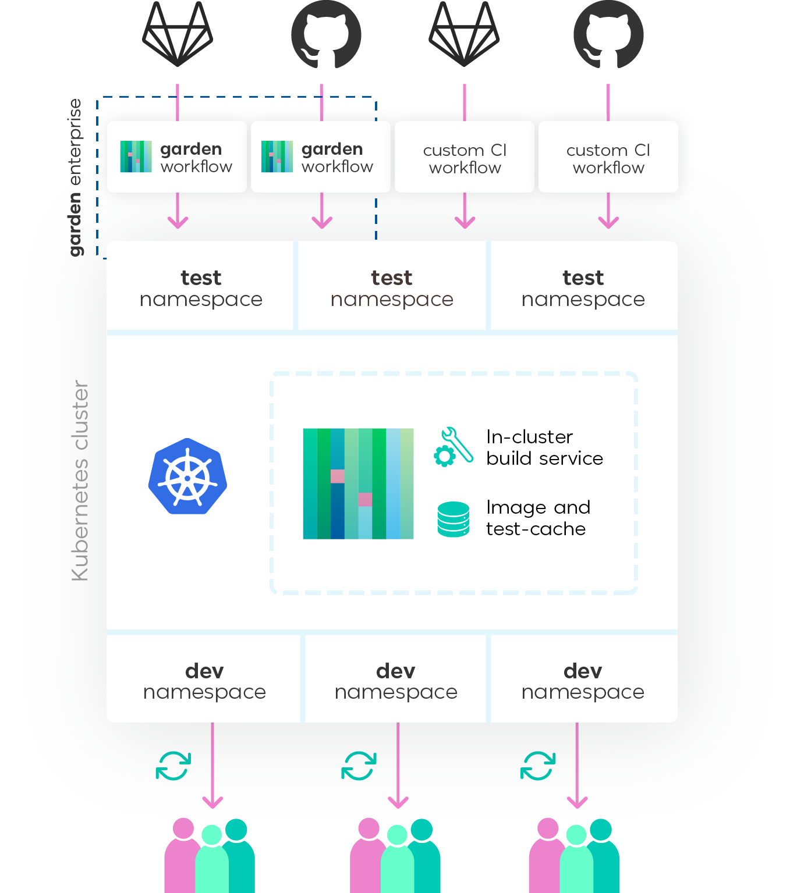

  

**Garden is an automation platform for Kubernetes development and testing.** Remove barriers between development, testing, and CI. Use the same workflows and production-like Kubernetes environments for every step of the development process.

Common use cases:

- **In-cluster development** for Kubernetes applications.
- **Fast & consistent CI pipelines** via a common configuration for development, testing, and CI and shared build & test caches.
- **Integration testing** in a production-like environment that captures the complete configuration of the application.
- **Manual QA & review** via production-like preview environments that can easily be shared with teammates. 

[Learn more about common Garden use cases.](#common-use-cases-what-can-i-do-with-garden)

Featuring:

- **In-cluster builds:** Build images in your Kubernetes development cluster–and avoid having to use local Kubernetes clusters.
- **Test orchestration:** Garden has first-class support for testing, and allows you to easily define tests that run in-cluster, alongside your services.
- **Result caching:** Build and test results are shared between users when using the same cluster. Teams can easily share build and test results, and your CI can use the same build caches as the team.

| Resources | What is it? |
| --------- | ----------- |
| [Garden Website](https://garden.io/?utm_source=github) | The official Garden website|
| [Garden Documentation / Getting Started](https://docs.garden.io/?utm_source=github) | Documentation for all editions of Garden, and the best place to get started |
| [Blog](https://garden.io/blog?utm_source=github) | The Garden blog, where we share product updates, how-to guides, and other resources |
| [Community Slack](https://chat.garden.io) | The best place to ask questions as a user of Garden |
| [Garden Enterprise](https://garden.io/product?utm_source=github#enterprise) | Garden Enterprise is built on top of the open source product and includes centralized environment management, secrets and user management, direct integration with VCS, and more. |

> _If you’re using Garden or if you like the project, please ★ star this repository to show your support 💖_

- [Common Use Cases: What Can I Do With Garden?](#common-use-cases-what-can-i-do-with-garden)
- [Features: Why Use Garden?](#features-why-use-garden)
- [How does Garden work?](#how-does-garden-work)
- [FAQs](#faqs)
- [Project Status](#project-status)
- [Stay in Touch](#stay-in-touch)

## Common Use Cases: What Can I Do With Garden?

Users typically implement Garden for one or more of the following:

- **In-cluster Development:** With Garden, developers working on Kubernetes applications can spin up a production-like, namespaced environment in a cluster, on demand. With in-cluster environments, devs don't need to run Docker, Kubernetes, or a complex distributed application on their laptops. 
- **Fast & Consistent CI Pipelines:** Garden makes it possible to use the same configuration for development, testing, and CI, which ensures consistency across different environments. You can run the exact same tests from a production-like development environment that will later be run in CI, meaning a much more predictable pipeline. In addition, Garden's shared cached results for image builds and tests means that your CI pipeline will run much faster, reducing cycle time and getting new features merged more quickly.
- **Integration Testing:** Because Garden environments capture the full configuration of an application, it’s possible to run proper integration tests with runtime dependencies–no mocking or stubbing required. A developer can run integration tests with a single command before creating a PR to get fast feedback and iterate more quickly, or integration tests can be run against a feature branch every time a PR is created.
- **Manual QA & Code Review:** Garden enables developers, QA engineers, and product managers to spin up production-like preview environments on demand. These preview environments can be used, for example, to QA any part of an application that can’t be covered by automated testing (e.g. complex frontend functionality) or in cases when client developers need a fully-functioning backend to validate new features. Product managers can use Garden preview environments to review a working version of an application for pre-release acceptance testing. 

## Features: Why Use Garden?

- **Common configuration for development, testing, and CI:** With Garden, use the same configuration and set of workflows for development, testing, and CI. Ensure consistency at every step of your development process. 
- **Production-like Kubernetes environments:** A Garden environment captures the full configuration of an application, [including all adjacent services and dependencies](https://docs.garden.io/using-garden/tests). Garden environments provide consistency across your entire org–no more, “Well, it works fine on my laptop.”
- **Namespaced environments on demand:** Any developer can spin up (and tear down) a namespaced environment in a shared cluster without help from DevOps, or an environment can be created by CI on every pull request.
- **Stack-aware builds and testing with result caching:** Garden is aware of the relationships between the services in your stack, and so instead of building an entire application or running a full suite of integration tests every time, Garden will only build or test what’s necessary based on what’s been changed. These build and test results are cached and can be shared across developers on a team. The result: much faster builds and test runs, which means faster feedback loops for developers.
- **Shared development clusters with fast in-cluster building:** Build images in your Kubernetes development cluster, thus eliminating the need for local Kubernetes clusters (in other words, no Docker or Kubernetes on your local machine).
- **Define [tasks](https://github.com/garden-io/garden/tree/0.12.23/examples/tasks)** that run as part of your deployment process—e.g. database migrations or scaffolding.
- **[Remote sources (multi-repository) support:](https://docs.garden.io/advanced/using-remote-sources)** Garden allows your project to automatically pull code from different repositories.
- **Hardware and platform flexibility:** Run Garden on-prem or in one of several supported cloud providers. Build, test, and deploy Docker containers, [Helm charts](https://docs.garden.io/guides/using-helm-charts), and more. Choose from a variety of Kubernetes platforms and CI tools.
- **Terraform integration:** Garden includes a [Terraform provider](https://docs.garden.io/advanced/terraform) that you can use to automatically validate and provision infrastructure as part of your project.
- **Extensible plugin system:** Garden’s plugin system ensures you’ll be able to create custom module types tailored to your needs or take advantage of existing plugins (e.g. conftest, hadolint).
- **Enterprise edition with support (if you need it):** Garden offers an enterprise edition of the product which provides secrets management, centralized environment management, direct integration with GitHub and other VCS providers, and enterprise security features (e.g. RBAC, SSO). The enterprise product comes with support SLAs and access to technical consulting. To learn more, [check out our website](https://garden.io/product?utm_source=github#enterprise) or [get in touch](https://garden.io/contact?utm_source=github).

## Documentation

You can find Garden’s full documentation at <https://docs.garden.io>.

## How does Garden work?

Garden Core is a standalone tool that can run from CI or from a developer’s machine. It allows you to codify a complete description of your stack, including how it's built, deployed and tested, using the [Stack Graph](https://docs.garden.io/basics/stack-graph)—making your workflows reproducible and portable.

With the Stack Graph, each part of your stack can describe itself using simple, intuitive declarations, without changing any of your code. Garden collects all of your declarations—even across multiple repositories—into a full graph of your stack, and leverages that information to help you develop and test faster.

When you run Garden with a shared Kubernetes cluster, Garden sets up its own namespace with a small set of services, including:

- **Image cache and test cache:** Every time an image is built for a service, Garden saves it a cache. If a different developer wants to deploy the same version of an image, the image doesn’t have to be rebuilt—instead, Garden will check if the image exists in the Docker registry and skip the build step if it does. Test results are also saved in a test cache and can be shared across developers. These caches can reduce build and test time significantly, often by 80% or more.
- **Build service:** Developers and CI processes don’t need to run Docker and Kubernetes on their machine (unless they want to). The build service makes it possible for all of this to be handled in the cluster.

Every developer, in turn, has a private namespace in the cluster. With one command, a dev can spin up a development and testing environment in their private namespace. In other words, they get a full instance of the application running in a namespace that they can then test and develop against.

And whenever you open a PR or merge a branch, your CI processes can also spin up a testing environment in a namespace on the same Kubernetes cluster.

See our [documentation](https://docs.garden.io) for more details.

## FAQs

**How is Garden different from other Kubernetes development tools?**

Garden goes beyond inner-loop development and unifies development, testing, and CI with a common configuraiton and set of workflows. You can use Garden to give developers a production-like environment in a cluster where they can iterate quickly and run integration tests on demand, to spin up preview environments to manually QA a new feature, to optimize your CI pipeline via a shared cache of build and test results, and more. Garden has many features to manage dependencies, tests and other relationships between different parts of your stack. In turn, Garden might take a little bit longer to get started with, and has some additional terminology to learn.

Tools such as Skaffold and Tilt, for example, are coupled to Kubernetes, whereas Garden is designed to be more extensible and flexible. Tight coupling can in some cases enable more specific Kubernetes-related features. But even with its flexibility, we still believe that Garden offers some of the most comprehensive Kubernetes functionality available.

We also strongly feel that testing and development tools should be adaptable across platforms, especially considering all the interesting technologies that are on the horizon, such as WASM, serverless, edge functions, etc.

**Is Garden a CI platform/tool?**

Not exactly, but you can certainly use Garden to make your CI faster and easier to work with. We highly recommend [running Garden from your CI](https://docs.garden.io/guides/using-garden-in-ci) setup, so that you can re-use the same structure and config, as well as your build and test result caches (if you’re using shared dev clusters).

**Does Garden work with Nomad/Fargate/Lambda/<other platform>?**

We currently primarily support Kubernetes, but Garden is designed to be pluggable to work with any operational platform. Our focus is on making development and testing of distributed systems faster and easier. Kubernetes is where we’re focusing our efforts today because that’s the platform of choice for a large majority of our user base. That said, we have made experimental plugins for Google Cloud Functions and more.

When we release our plugin SDK (tentatively later this year), we plan on working with the developer community to support a variety of platforms, including a number of serverless/FaaS platforms. This will allow users to pick and choose platforms for individual services, but keep the same testing and development workflows across the board.

**Should I use Garden to deploy to production?**

Technically, there are many cases where you can use Garden to deploy to production. But at this point in time, Garden is not expressly designed for production rollouts and does not yet support capabilities such as gradual rollouts or canary deployments.

As your needs evolve (if they haven’t already), we recommend using helm modules or raw Kubernetes manifests using the kubernetes module type. You can then use those same Helm charts and manifests with any CD/GitOps tool of your choosing.

**Is there an enterprise edition, or is enterprise support available?**

Yes, Garden (the company) offers an enterprise version of the product–and enterprise support is only available to customers of the enterprise product. If you’d like to ask questions about our enterprise offering, [you can reach out here](https://garden.io/contact?utm_source=github).

**Why TypeScript?**

We find TypeScript strikes a good balance between power and simplicity, and it handles asynchronous work really well. We also get rid of some of the key weaknesses of Node.js by using Zeit’s [pkg](https://github.com/zeit/pkg) to distribute Garden as a single binary, so users don’t need to think about npm and all that stuff. We plan on splitting Garden into more components, some of which will be written in Go, and to make plugin SDKs for both TypeScript/JavaScript and Go.

**Why the name "Garden”?**

We feel it’s a nice and welcoming name :) And we like the notion that your software grows in a living environment. Like a well kept garden of flowers and plants, your software stack is a living system of living things. Seasons change, as technologies do. New ideas come alive and some die or fall out of favor. Most importantly, all of them need to work and thrive together in their little ecosystem—your own Garden.

## Project Status

Garden is in active use by a number of teams. Until Garden reaches 1.0, APIs may still change between minor releases (0.x). Patch releases (0.x.y) are guaranteed not to include any breaking changes. We detail all breaking changes in our release notes.

To learn about Garden Enterprise (generally available from November 2020), [please visit the Garden website](https://garden.io/product?utm_source=github#enterprise).

## Stay in Touch

- Join the #garden channel on the [Kubernetes Slack](https://chat.garden.io/) to ask questions and give feedback
- [Follow us on Twitter](https://twitter.com/garden_io) to stay up to date on product announcements, blog posts, webinars, and other resources.
- To discuss an enterprise license and enterprise support, [contact us here](https://garden.io/contact?utm_source=github).

## Acknowledgements

Garden would not be possible without an amazing ecosystem of open-source projects. Here are some of the projects that Garden uses, either directly or indirectly:

- [Kubernetes](https://kubernetes.io/)
- [TypeScript](https://www.typescriptlang.org/)
- [zeit/pkg](https://github.com/zeit/pkg)
- [Moby](https://github.com/moby/moby)
- [Helm](https://helm.sh/)
- [OpenFaaS](https://www.openfaas.com/)
- [Golang](https://golang.org/)
- [Hadolint](https://github.com/hadolint/hadolint)
- [conftest](https://www.conftest.dev/)

Garden, as a company, is also a proud member of the [CNCF](https://www.cncf.io/).

## Telemetry

We are trying to make Garden the best tool possible, and it's very useful for us to inform the future development of Garden with data on how it's being used.

When you use Garden we collect information about the commands you run, the tasks getting executed, the project and operating system. We care about your privacy and we take special care to anonymize all the information. For example, we hash module names, and use randomly generated IDs to identify projects.

If you are curious to see an example of the data we collect or if you would like to update your preference, please visit the [Telemetry](https://docs.garden.io/telemetry) page.

## License

Garden is licensed according to [Mozilla Public License 2.0 (MPL-2.0)](LICENSE.md).
