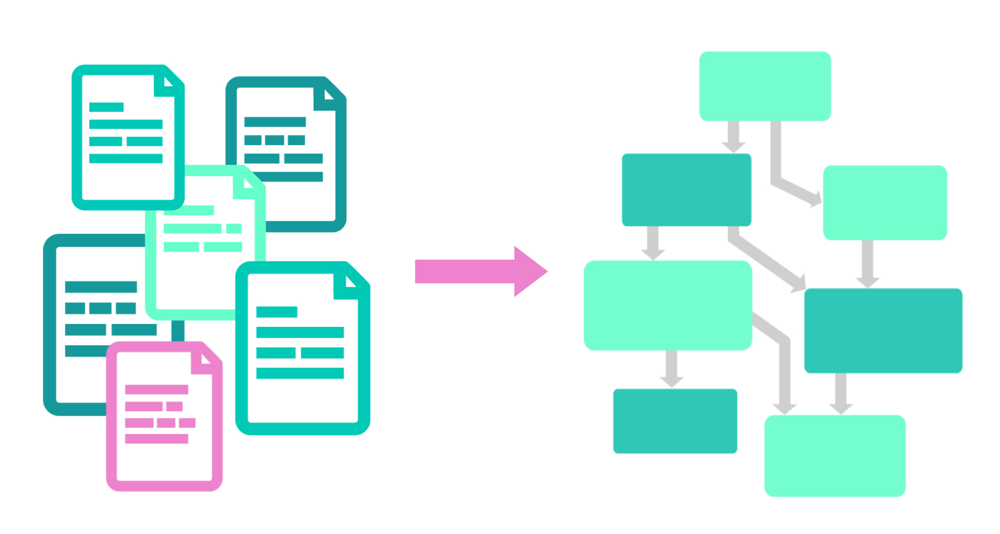

<p align="center">
  
</p>

**Garden is a developer tool that automates your workflows and makes developing and testing Kubernetes applications faster and easier than ever.**

- Keep your development environment **up-to-date as you code**, and get rapid feedback.
- **Develop and iterate as quickly with remote clusters as you do locally**, and share development clusters with your team. With remote clusters you can even **run Garden without Kubernetes or Docker installed** on your machine!
- **Start simple** and grow complexity gradually as your needs evolve. Use simplified abstractions to start, and move to raw Kubernetes YAML, Helm, etc. only when you have to.
- **Simplify your CI** by running the same commands and configuration during development and testing—and use the same build and test caches!

> _If you’re using Garden or if you like the project, please ★ star this repository to show your support 💖_


## Features

- Spin up your whole stack with a single command, and (optionally) watch for changes. Only what’s needed gets re-built, re-deployed, and/or re-tested, so you get a **much faster feedback loop**.
- **Shared development clusters with fast in-cluster building and image caching for Kubernetes.** This allows teams to easily share build and test results, and for CI to become much faster because it can use the same build and test caches as the team.
- Get helpful information when your deployments fail. Garden collects events and logs and displays them prominently when issues come up, and strives to "fail fast", so that you don't need to wait for timeouts or dive into kubectl whenever something is wrong.
- Easily write [integration test suites](https://docs.garden.io/guides/development-workflows#tests-and-dependencies) that have runtime dependencies. Run tests *before* pushing your code to CI, and avoid having to mock or stub your own services.
- Define [tasks](https://github.com/garden-io/garden/tree/v0.11.5/examples/tasks) that run as part of your deployment process—e.g. database migrations or scaffolding.
- [Hot reload](https://docs.garden.io/guides/hot-reload) lets you near-instantaneously update code and static files in containers as they run, for services that support in-place reloading.
- [Remote sources](https://docs.garden.io/guides/using-remote-sources) support allows your project to automatically pull code from different repositories.
- The built-in web **dashboard** gives you a full overview of your stack (and many more UI features are planned to further aid with development).
- Build, test and deploy Docker containers, [Helm charts](https://docs.garden.io/guides/using-helm-charts), OpenFaaS functions and more.
- An extensible plug-in system ensures you’ll later be able add anything that’s not on the above list, or create custom module types tailored to your needs (*due summer 2019*).

## Installation

*(Check out our documentation for more [detailed instructions](https://docs.garden.io/installation))*

### macOS

```sh
    brew tap garden-io/garden
    brew install garden-cli
```

### Linux

```sh
    curl -sL https://get.garden.io/install.sh | bash
```

### Windows

```sh
    Set-ExecutionPolicy Bypass -Scope Process -Force; iex ((New-Object System.Net.WebClient).DownloadString('https://raw.githubusercontent.com/garden-io/garden/master/support/install.ps1'))
```

## Quick start

With the CLI installed, you can try out a few commands using the [Demo Project](https://docs.garden.io/examples/demo-project) from our [example projects](https://github.com/garden-io/garden/tree/v0.11.5/examples). The example project consists of a couple of simple modules, each defining one service.

*Note: This example assumes you have a local Kubernetes instance running.*

Clone the repo and change into the `demo-project` directory:

```sh
    git clone https://github.com/garden-io/garden.git
    cd garden/examples/demo-project
```

Set up your environment, build the services and deploy the project by running:

```sh
    garden deploy
```

The services are now running on the Garden framework. You can see for yourself by querying the `/hello-backend` endpoint of `backend`’s running container:

```sh
    garden call backend/hello-backend
```

To run tests for all modules:

```sh
    garden test
```

And if you prefer an all-in-one command that watches your project for changes and re-builds, re-deploys, and re-tests automatically, try:

```sh
    garden dev
```

You can leave it running and change one of the files in the project, then watch it re-build and re-test as you edit your code!

## Documentation

You can find Garden’s full documentation at [https://docs.garden.io](https://docs.garden.io/).

Overview:

- [Using Garden](https://docs.garden.io/using-garden)—short Guides on incrementally adding the main Garden constructs to your project.
- [Guides](https://docs.garden.io/guides)—development workflows, Garden configuration files, usage with remote Kubernetes clusters, and setting up hot reload.
- [Example Projects](https://docs.garden.io/examples)—guides based on some of the [examples](https://github.com/garden-io/garden/tree/v0.11.5/examples).
- [Reference](https://docs.garden.io/reference)—glossary, commands reference, configuration files reference, and template strings reference.
- [FAQs](https://docs.garden.io/#faqs).

The [examples](https://github.com/garden-io/garden/tree/v0.11.5/examples) folder of our repository also shows a myriad of different ways to use Garden. Check out the README in each example for more information

## How does it work?

Garden runs as a developer tool on your machine or in CI, that looks at your source code and configuration files, runs tests, and resolves your changes to update your development environment. Garden can watch your files and run continuously, or you can trigger it manually via the CLI.

For configuration, Garden is centered around the **[Stack Graph](https://docs.garden.io/stack-graph)**, which allows you to fully codify how each part of your stack is built, deployed and tested—making your workflow reproducible and portable.

<p align="center">
  
</p>

With the Stack Graph, each part of your stack can *describe itself* using simple, intuitive declarations, without changing any of your code. Garden collects all of your declarations—even across multiple repositories—into a full graph of your stack, and leverages that information to help you develop and test faster.

## FAQs

<details>
<summary><b>Is Garden a CI platform/tool?</b></summary>

Not exactly, but you can certainly use Garden to make your CI faster and easier to work with. We highly recommend [running Garden from your CI setup](https://docs.garden.io/examples/using-garden-in-ci), so that you can re-use the same structure and config, as well as your build and test result caches (if you're using shared dev clusters).
</details>
<br>
<details>
<summary><b>Does Garden work with Docker Swarm/Mesos/&lt;other platform&gt;?</b></summary>

We currently primarily support Kubernetes, but Garden is designed to be pluggable to work with any operational platform. Our focus is on making development and testing of *distributed systems* faster and easier, but Kubernetes is where we're focusing our efforts today.

That said, we have made experimental plugins for Docker Swarm, Google Cloud Functions and more. When we release our plugin SDK later this year, we plan on working with the developer community to support a variety of platforms, including a number of serverless/FaaS platforms. This will allow users to pick and choose platforms for individual services, but keep the same development and testing workflows across the board.
</details>
<br>
<details>
<summary><b>How is Garden different from Skaffold/Tilt?</b></summary>

Garden generally has a broader focus, and has a lot of features to manage dependencies, tests and other relationships between different parts of your stack. In turn, Garden may be slightly more complex to get started with, and has some additional terminology to learn. Skaffold and Tilt are also coupled to Kubernetes, whereas Garden is designed to be more extensible and flexible.

This has pros and cons in either direction, since tight coupling can in some cases enable some more specific Kubernetes-related features. However, we feel strongly that your developer tools should be adaptable across platforms, especially considering all the interesting technologies that are on the horizon, such as WASM, serverless, edge functions, etc.

</details>
<br>
<details>
<summary><b>Should I use Garden to deploy to production?</b></summary>

You can use `garden deploy` to deploy to production if you don't need gradual rollouts, canary deployments, etc. but Garden does _not yet_ support those directly.

As your needs evolve (if they haven't already), we recommend using `helm` modules or raw Kubernetes manifests using the `kubernetes` module type. You can then use those same Helm charts and manifests with any CD/GitOps tool of your choosing.

</details>
<br>
<details>
<summary><b>How much does Garden cost?</b></summary>

Garden is free and open source. We are working on SaaS and Enterprise products that *use* the open-source project, but we will not make a closed-source version of this project. If you need professional support, please [reach out](https://garden.io/#get-demo).

</details>
<br>
<details>
<summary><b>Why TypeScript?</b></summary>

We find TypeScript strikes a good balance between power and simplicity, and it handles asynchronous work really well. We also get rid of some of the key weaknesses of Node.js by using Zeit's [pkg](https://github.com/zeit/pkg) to distribute Garden as a single binary, so users don't need to think about npm and all that stuff.

We do plan on splitting Garden into more components, some of which will be written in Go, and to make plugin SDKs for both TypeScript/JavaScript and Go.

</details>
<br>
<details>
<summary><b>Why the name "Garden?</b></summary>

We feel it's a nice and welcoming name :) And we like the notion that your software grows in a living environment. Like a well kept garden of flowers and plants, your software stack is a living system of living things.

Seasons change, as technologies do. New ideas come alive and some die or fall out of favor. Most importantly, all of them need to work and thrive together in their little ecosystem—your own Garden.

</details>

## Status

Until Garden reaches 1.0, APIs may still change between minor releases (0.x). Patch releases (0.x.y) are guaranteed not to include any breaking changes. We detail all breaking changes in our release notes.

## Support

Please join the #garden channel on the [Kubernetes Slack](https://slack.k8s.io/) to ask questions, discuss how Garden can fit into your workflow, or just chat about all things DevOps.

## Acknowledgements

Garden would not be possible without an amazing ecosystem of open-source projects. Here are some of the projects that Garden uses, either directly or indirectly:

- [Kubernetes](https://kubernetes.io/)
- [OpenFaaS](https://www.openfaas.com/)
- [TypeScript](https://www.typescriptlang.org/)
- [Golang](https://golang.org/)
- [Moby](https://github.com/moby/moby)
- [Helm](https://helm.sh/)
- [zeit/pkg](https://github.com/zeit/pkg)

Garden, as a company, is also a proud member of the [CNCF](https://www.cncf.io/).

## Telemetry

We are trying to make Garden the best tool possible, and it's very useful for us to inform the future development of Garden with data on how it's being used.

When you use Garden we collect information about the commands you run, the tasks getting executed, the project and operating system. We care about your privacy and we take special care to anonymize all the information. For example, we hash module names, and use randomly generated IDs to identify projects.

If you are curious to see an example of the data we collect or if you would like to update your preference, please visit the [Telemetry](https://docs.garden.io/telemetry) page.

## License

Garden is licensed according to [Mozilla Public License 2.0 (MPL-2.0)](LICENSE.md).