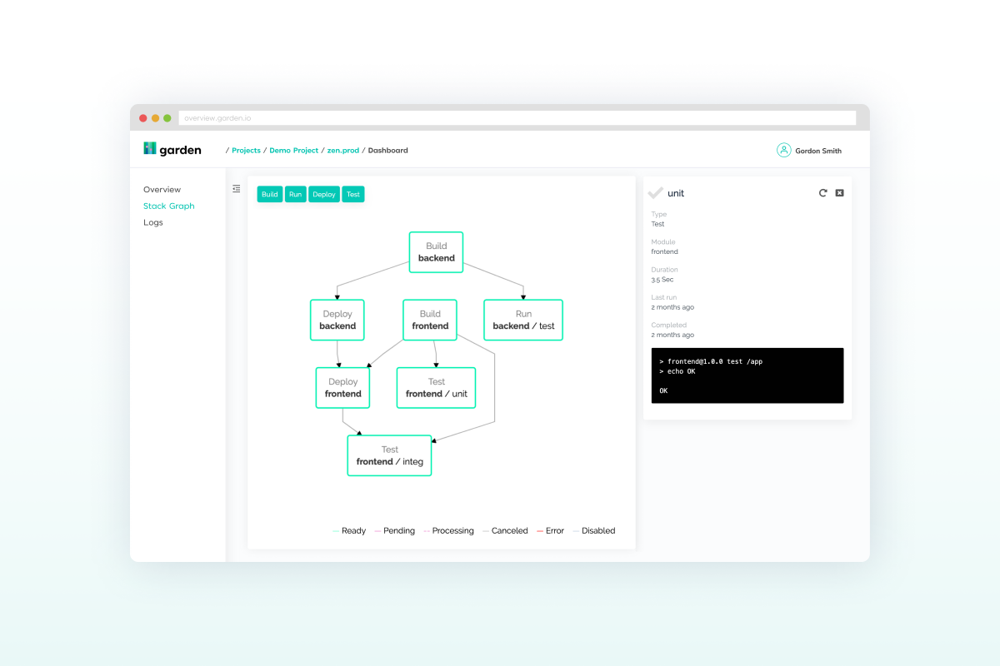

# How Garden Works

Garden Core is a standalone tool that can run from CI or from a developer’s machine. It allows you to codify a complete description of your stack, including how it's built, deployed and tested, using the [Stack Graph](https://docs.garden.io/basics/stack-graph)—making your workflows reproducible and portable.

With the Stack Graph, each part of your stack can describe itself using simple, intuitive YAML declarations, without changing any of your existing code. Garden collects all of your declarations—even across multiple repositories—into a full graph of your stack, and leverages that information to help you develop and test faster.

Garden is pluggable by design and supports a variety of [providers](../reference/providers/) and [module types](../reference/module-types/), which you can choose based on preference and to suit your existing set-up.

When you run Garden with a shared Kubernetes cluster, Garden has its own namespace with a small set of services, including:

* **Image cache and test cache:** Every time an image is built for a service, Garden saves it a cache. If a different developer wants to deploy the same version of an image, the image doesn’t have to be rebuilt—instead, Garden will check if the image exists in the Docker registry and skip the build step if it does. Test results are also saved in a test cache and can be shared across developers. These caches can reduce build and test time significantly, often by 80% or more.
* **Build service:** Developers and CI processes don’t need to run Docker and Kubernetes on their machine \(unless they want to\). The build service makes it possible for all of this to be handled in the cluster.

Every developer, in turn, has a private namespace in the cluster. With one command, a dev can spin up a development and testing environment in their private namespace. In other words, they get a full instance of the application running in a namespace that they can then test and develop against.

And whenever you open a PR or merge a branch, your CI processes can also spin up testing environments in namespaces on the same Kubernetes cluster. With Garden Enterprise, you can also have [workflows](../using-garden/workflows.md) automatically trigger from version control, separately from your CI system.

