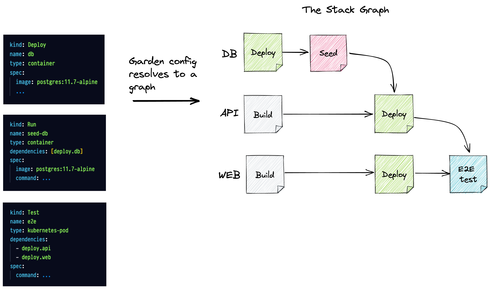
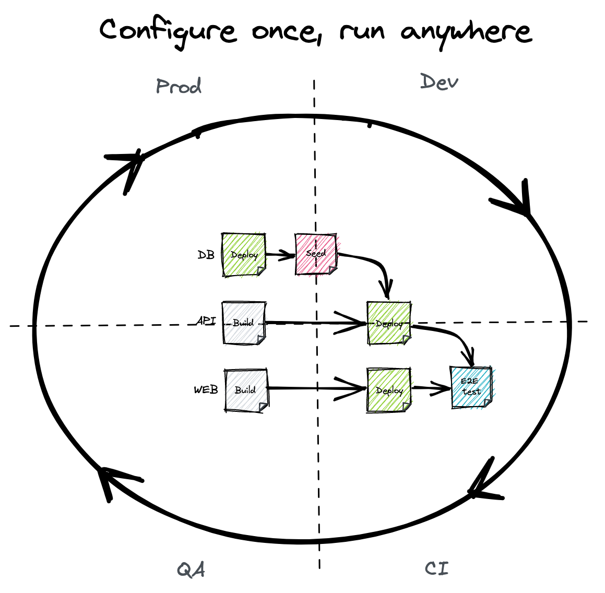
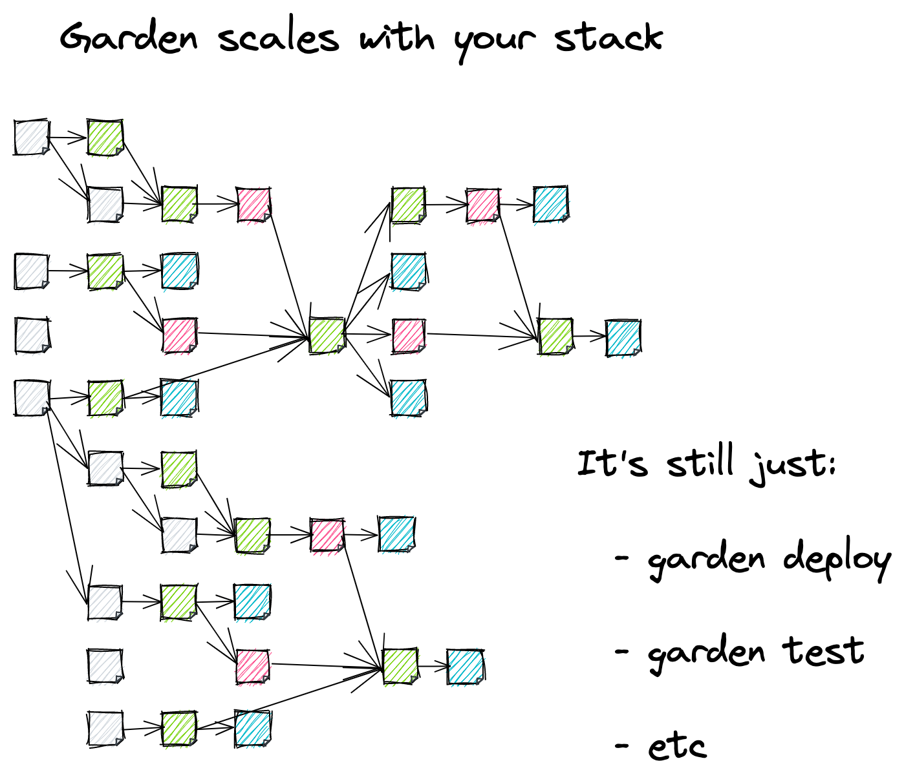
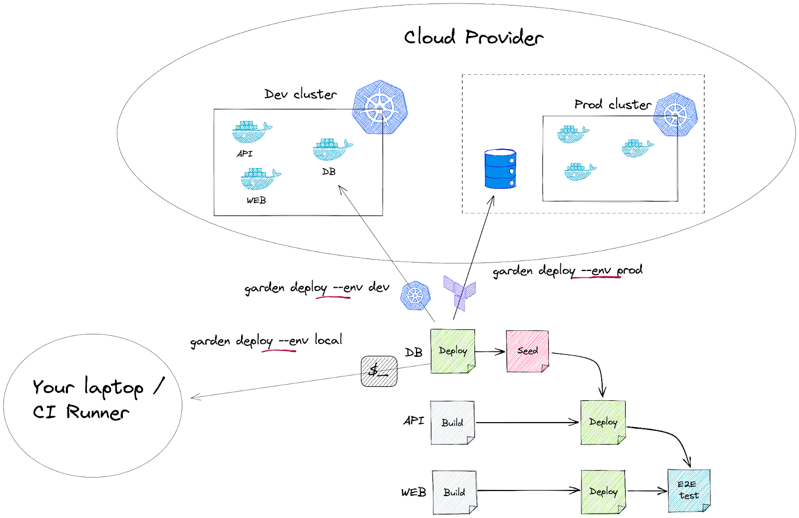

# How Garden Works

For those that prefer something a bit more visual, we recommend checking out this [short introduction video](https://www.youtube.com/watch?app=desktop&v=3gMJWGV0WE8) to how Garden works.

## **The Stack Graph**

Garden Core is a standalone binary that can run from CI or from a developer’s machine. It allows you to codify a complete description of your stack using intuitive YAML declarations—making your workflows **reproducible and portable**.

It is based on the simple idea that all DevOps workflows can be fully described in terms of the following four actions:

- **build**
- **deploy**
- **test**
- **run** (for running ad-hoc tasks)

…along with the dependencies between these actions across the components of the system.

To make a concrete example, here’s a simplified description of a three tier web application:

```yaml
# This config is in a single file for convenience.
# You can split it into multiple files and even across repositories!
kind: Module
name: db
type: container
image: postgres:12
tasks:
  - name: db-seed
    # ...
---
kind: Module
name: api
type: helm
dependencies: [db-seed]
---
kind: Module
name: web
type: kubernetes
dependencies: [api]
tests:
  - name: e2e
    # ...

```

Garden collects all of these descriptions, even across multiple repositories, into the Stack Graph—**an executable blueprint for going from zero to a running system in a single command**.



Garden then leverages your existing configuration (Helm charts, Kubernetes manifests, Dockerfiles, Terraform files, etc) and infrastructure to execute the graph **in any environment**.



The Stack Graph is pluggable so how these actions (i.e. the graph nodes) are actually run depends on the plugins used (see below).

## **The Garden CLI**

Each of the four actions (build, deploy, test, run) has a corresponding command that you can run with the Garden CLI.

For example, to create a preview environment on every pull request, simply add the following to your CI pipeline:

```yaml
garden deploy --env preview
```

Or say a developer wants to run an end-to-end test from their laptop as they code. Again, it’s simple:

```yaml
garden test --name e2e
```

Garden also has a special mode called “dev mode” which live reloads changes to your running services—ensuring **blazing fast feedback while developing**. To enable it, simply run:

```yaml
garden dev
```

There are also a handful of utility commands for getting logs, exec-ing into services, publishing images, and more.

Thanks to the Stack Graph, these workflows stay consistent no matter how big your stack grows.




## **Plugins**

Garden is pluggable by design and supports a variety of providers and module types, which you can choose based on preference and to suit your existing set-up.

It’s the plugins that determine what happens when you run a given Garden command. Each action, or node in the graph, belongs to a plugin which is responsible for executing it.

You can for example use the Kubernetes plugin to install your Helm charts and apply your Kubernetes manifests, and the Terraform plugin to provision infrastructure.

For more detail on how some common plugins work, see below:

- How the Kubernetes plugin works
- How the Terraform plugin works

We will be adding more plugins and releasing a Plugin SDK (exact timeline TBD) which will allow the community to maintain their own Garden plugins.

Sky’s the limit but to name some examples:

- Plugins for serverless runtimes will allow users to mix and match platforms in the same project.
- Security plugins that benefit from Garden’s caching and only run time consuming scans when needed.
- Language specific plugins for streamlining workflows.

**This ensures that Garden is future proof and can grow with your stack. No need to retool or disrupt developer workflows for the “next big thing”.**

## **Caching**

One of the most important features of Garden is its smart caching abilities. Thanks to the graph structure, Garden can calculate the version of any part of your system, while accounting for upstream dependencies.

**This ensures that the same image never needs to be built twice or the same test run twice.**

If the end-to-end test in the example above passes, Garden will know not to run it again if the code hasn’t changed. Since Garden factors in dependencies, it will however re-run the test if any of the upstream services under test are modified.

Most tools don’t have this granular understanding of the system and the choice is between running everything or nothing. With Garden you can be confident that tests run when they **need to,** but no more.

This alone can speed up your pipelines by orders of magnitude.

## **Templating**

Garden has a powerful templating engine that allows you to set variables and enable or disable parts of the graph depending on your environment.

You might for e.g. deploy a development database with the Kubernetes plugin in development but use the Terraform plugin to provision a managed database for production.

This allows you to codify your entire stack and use the same workflows for all stages of software delivery.




## **Garden Cloud**

Garden Cloud is a web platform built on top of Garden Core that adds features for teams using Garden Core such as user and secret management, log streaming, interactivity, and much more.

To learn about Garden Cloud, check out our [website](https://garden-io.webflow.io/pricing) or the official [Cloud docs](https://cloud.docs.garden.io/).