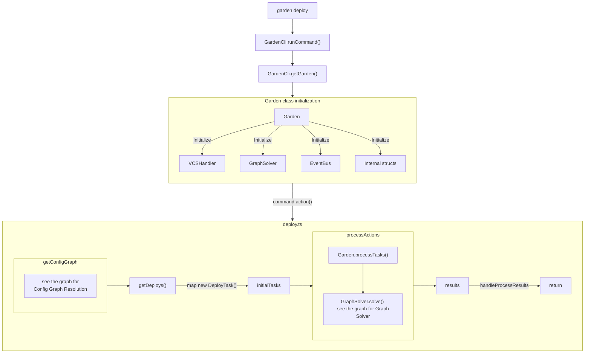
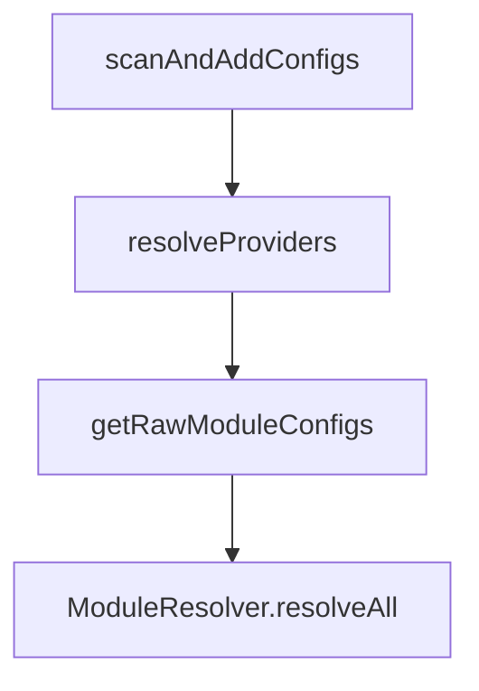
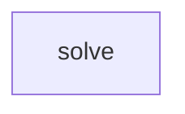

# garden flowchart

Assumes all external garden plugins (outside of the `core` package) are loaded.

## High-level flow of `garden deploy` command

## Config Graph Resolution

TODO:

## Graph Solver

TODO:

