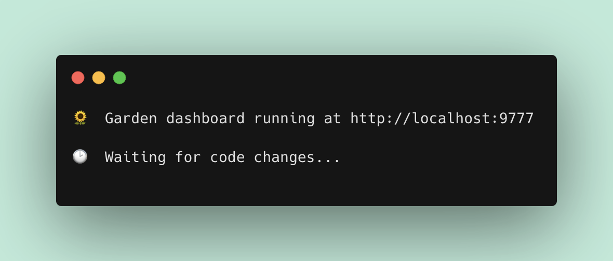
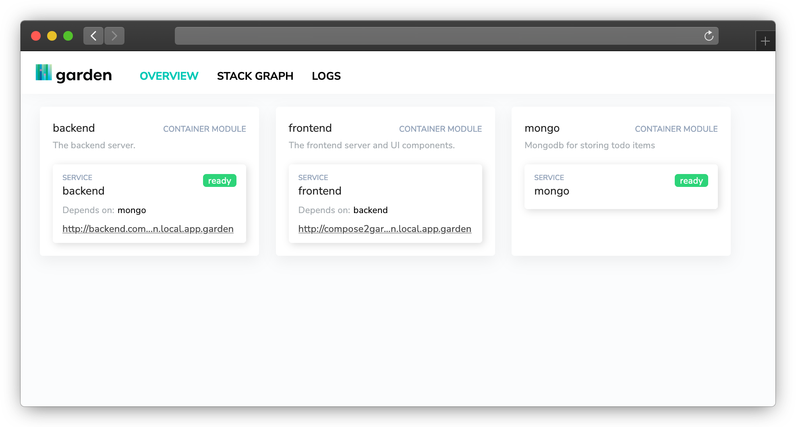
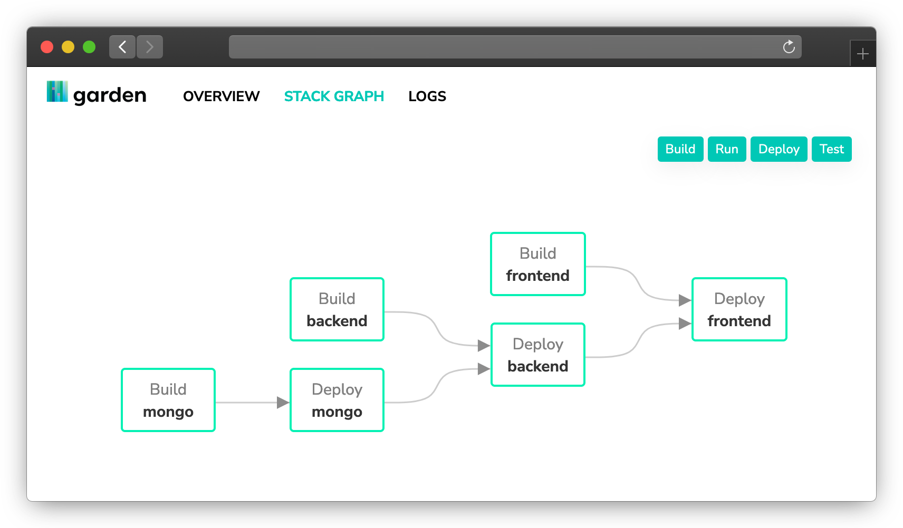

# Migrating from Docker Compose to Garden

If you already have an application built using Docker Compose and want to migrate it to Garden, you can do this by adding the correct `*.garden.yml` files. In this guide, we'll walk through an example of converting a simple Docker Compose project to Garden. You can follow along with the example, or substitute your own Docker Compose project where relevant.

## Pre-requisites

To follow along, you should have:

* Basic familiarity with Garden ([Projects](https://docs.garden.io/using-garden/projects), [Modules](https://docs.garden.io/using-garden/modules), [Dev mode](https://docs.garden.io/guides/code-synchronization-dev-mode)).
* [Docker Desktop](https://www.docker.com/products/docker-desktop/) running locally.
* A local Kubernetes cluster running inside Docker Desktop.
* A project that currently uses Docker Compose (or follow along using the provided example).

## Getting the example application 

Clone our [example Docker Compose application](https://github.com/garden-io/garden-docker-compose) and take a look around. In summary, our application is built with a backend (Express), a frontend (React), and a database (MongoDB). 

The frontend and backend modules each have their own Dockerfile, and there is a top-level `docker-compose.yml` file to tie them together and to add MongoDB.

This application is based on the one at https://github.com/docker/awesome-compose/tree/master/react-express-mongodb. We've added four `*.garden.yml` files, which we'll walk through now in detail.

### The `project.garden.yml` file

In the root of the directory, we've added `project.garden.yml` with the following contents:

```yaml
kind: Project
name: compose2garden

environments:
  - name: default
    variables:
      base-hostname: compose2garden.local.app.garden

providers:
  - name: local-kubernetes
```


This is a `Project` level file. We call it `compose2garden` in our example, but you can use your own name. We configure a single environment and specify the hostname where we can visit the running application. Finally, we configure `local-kubernetes` (a Kubernetes cluster running in Docker Desktop) as our provider.

### The `backend/backend.garden.yml` file

For our backend module, we've added another Garden configuration file with the following contents:

```yaml
kind: Module
name: backend
description: The backend server.
type: container
services:
  - name: backend
    devMode:
      sync:
        - source: ./
          target: /usr/src/app
          mode: "one-way-replica"
    ports:
      - name: http
        containerPort: 3000
    healthCheck:
      httpGet:
        path: /api
        port: http
    ingresses:
      - path: /
        port: http
        hostname: backend.${var.base-hostname}
    dependencies:
      - mongo
```

This one is a `Module` instead of a `Project`. Under `devMode`, we set up syncing from the root folder to our built `app` folder so we can see code changes live when in developer mode. Under `ports`, we specify the same port as in our Docker Compose file (3000). We set up a health check for the the `/api` route, as that is what this module serves, and an ingress on a subdomain. In our case, this will let us access our backend service on `compose2garden.local.app.garden`. Finally, we specify the dependency on the `mongo` module, which we will define in a bit.

### The `frontend/frontend.garden.yml` file

For the frontend, we create another Garden module with the following contents:

```yaml
kind: Module
name: frontend
description: The frontend server and UI components.
type: container
exclude:
  - node_modules/**/*
services:
  - name: frontend
    env:
      DANGEROUSLY_DISABLE_HOST_CHECK: true
    devMode:
      sync:
        - source: ./src
          target: /usr/src/app/src
          mode: "one-way-replica"
    ports:
      - name: http
        containerPort: 3000
    healthCheck:
      httpGet:
        path: /
        port: http
    ingresses:
      - path: /
        port: http
    dependencies:
      - backend
```

This is similar to the backend module, but we specify the backend as a dependency, which makes the database (`mongo`) an indirect dependency.

### The `mongo/mongo.garden.yml` file

Here we've created a `mongo` folder, as it did not exist as an explicit module in our original Docker Compose project. The folder contains only the Garden configuration file, which contains:

```yaml
kind: Module
description: Mongodb for storing todo items
type: container
name: mongo
image: mongo:4.2.0
services:
  - name: mongo
    volumes:
      - name: data
        containerPath: /data/db
    ports:
      - name: db
        containerPort: 27017
```

This specifies the same volume and port that we previously specified in Docker Compose.

## Running a development version of the project on Garden

With the four config files added, we can test our service on Garden. We've moved from running on Docker to running on a local Kuberenetes cluster now, so make sure your Docker Desktop is configured accordingly.

Now run:

```bash
garden dev
```

in the project folder. Garden will start up locally. You should see output in your terminal showing that this worked successfully.



If you visit the URL, you'll see the Garden dashboard, where you'll see the status of the three individual modules.



If you click on "Stack Graph", you'll see the dependency graph that Garden calculated. Building `mongo`, `backend`, and `frontend` can each be done independently, but deploying the frontend requires the backend to be deployed first, which in turn relies on `mongo`.



## Deploying the Garden project to Kubernetes

To build and deploy your project, terminate the `garden dev` process and run `garden deploy`. Once this has completed, you'll have the example "To Do" application running on your local Kubernetes cluster.


## Larger migrations

This was a simple example, but it should give you what you need to migrate larger projects too. If you have feedback on how we could make migrating from Docker Compose easier, please send us feedback via [GitHub issues](https://github.com/garden-io/garden/issues), or reach out on our Slack channel.

