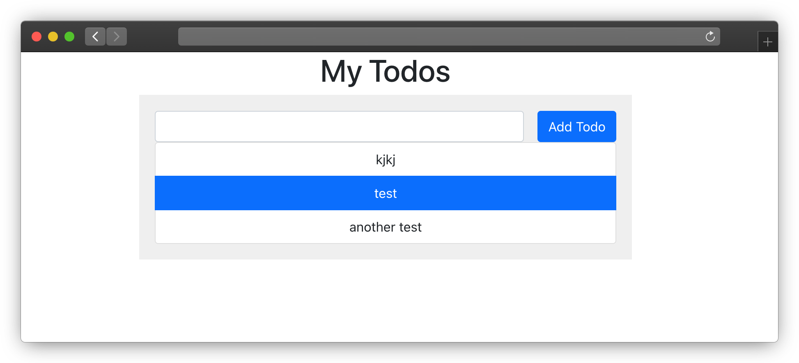

# Migrating from Docker Compose to Garden

If you already have an application configured to use Docker Compose and want to migrate it to Garden, you can do so by
adding the necessary Garden config files. In this guide, we'll walk through an example of converting a simple Docker
Compose project to Garden. You can follow along with the example, or substitute with your own Docker Compose project
where relevant.

## Prerequisites

To follow along, you should have:

* Basic familiarity with [Garden](../getting-started/basics.md) and [Sync mode](../features/code-synchronization.md)).
* [Docker Desktop](https://www.docker.com/products/docker-desktop/) running locally.
* A local Kubernetes cluster running inside Docker Desktop.
* A project that currently uses Docker Compose (or follow along using the provided example).

## Getting the example application

Clone our [example Docker Compose application](https://github.com/garden-io/garden-docker-compose) and take a look
around. In summary, our application is built with a backend (Express), a frontend (React), and a database (MongoDB).

The frontend and backend applications each have their own `Dockerfile`, and there is a top-level `docker-compose.yml`
file to tie them together and to add MongoDB.

This application is based on the one at https://github.com/docker/awesome-compose/tree/master/react-express-mongodb.
We've added four `*.garden.yml` files, which we'll walk through in detail.

### The `project.garden.yml` file

In the root of the directory, we've added `project.garden.yml` with the following contents:

```yaml
apiVersion: garden.io/v1
kind: Project
name: compose2garden

environments:
  - name: default
    variables:
      base-hostname: compose2garden.local.demo.garden

providers:
  - name: local-kubernetes
```

This is a `Project` level file. We call it `compose2garden` in our example, but you can use your own name. We configure
a single environment and specify the hostname where we can visit the running application. Finally, we
configure `local-kubernetes` (e.g. a Kubernetes cluster running in Docker Desktop) as our provider.

### The `backend/backend.garden.yml` file

For our `backend` application, we've added another Garden configuration file:

```yaml
kind: Build
apiVersion: garden.io/v1
name: backend
description: The backend server image
type: container

---
kind: Deploy
apiVersion: garden.io/v1
name: backend
description: The backend server container
type: container
dependencies:
  - build.backend
  - deploy.mongo
spec:
  image: ${actions.build.backend.outputs.deploymentImageId}
  sync:
    paths:
      - source: ./
        target: /usr/src/app
        mode: "one-way-replica"
  ports:
    - name: http
      containerPort: 3000
  healthCheck:
    httpGet:
      path: /api
      port: http
  ingresses:
    - path: /
      port: http
      hostname: backend.${var.base-hostname}
```

A `Build` action and a `Deploy` action are defined.
Make note of the `Deploy` action and it's configuration.

Under `sync` we set up syncing from the action root to the `app` folder on the container, so we can synchronize code
changes live when in `sync` mode.

Under `ports` we specify the same port as in our Docker Compose file (`3000`).

We set up a health check for the `/api` route, and an ingress on a subdomain.
In our case, this will let us access our `backend` application on `compose2garden.local.demo.garden`.

Finally, we specify the dependency on the `mongo` `Deploy` action, which we will define in a bit.

### The `frontend/frontend.garden.yml` file

For the `frontend` application we create separate Garden configuration file:

```yaml
kind: Build
apiVersion: garden.io/v1
name: frontend
description: The frontend server and UI components image
type: container
exclude:
  - node_modules/**/*

---
kind: Deploy
apiVersion: garden.io/v1
name: frontend
description: The frontend server and UI components container
type: container
dependencies:
  - build.frontend
  - deploy.backend
spec:
  image: ${actions.build.frontend.outputs.deploymentImageId}
  env:
    DANGEROUSLY_DISABLE_HOST_CHECK: true
  sync:
    paths:
      - source: ./src
        target: /usr/src/app/src
        mode: "one-way-replica"
  ports:
    - name: http
      containerPort: 3000
  healthCheck:
    httpGet:
      path: /
      port: http
  ingresses:
    - path: /
      port: http
```

This is similar to the `backend` application, but we specify the `backend` deployment as a dependency, which makes
the database (`mongo`) an indirect dependency.

### The `mongo/mongo.garden.yml` file

Here we've created a `mongo` folder, as it did not exist in our original Docker Compose project.
The folder contains only the Garden configuration file:

```yaml
kind: Deploy
apiVersion: garden.io/v1
description: MongoDB for storing todo items
type: container
name: mongo

spec:
  image: mongo:4.2.0
  volumes:
    - name: data
      containerPath: /data/db
  ports:
    - name: db
      containerPort: 27017
```

This specifies the same volume and port that we previously specified in Docker Compose.

## Deploying the Garden project to Kubernetes

To build and deploy your project run `garden deploy`. Once this has completed, you'll have the example "To Do"
application running on your local Kubernetes cluster.



Use `frontend` application's ingress URL from the console output to open the application.

## Running the Garden project in code synchronization mode

You can also try out [live code synchronization](../features/code-synchronization.md) with Garden.

Just run:

```bash
garden deploy --sync
```

in the project folder. Garden will start up locally. You will see output in your terminal showing that this worked
successfully.

Now try to modify some files in `backend` or `frontend` applications. The code changes will be synced to the running
applications.

## Larger migrations

This is a basic example but it should give you what you need to migrate larger projects too. If you have feedback on
how we could make migrating from Docker Compose easier, please send it our way
via [GitHub issues](https://github.com/garden-io/garden/issues) or reach out
on [our Discord community](https://discord.gg/FrmhuUjFs6).

