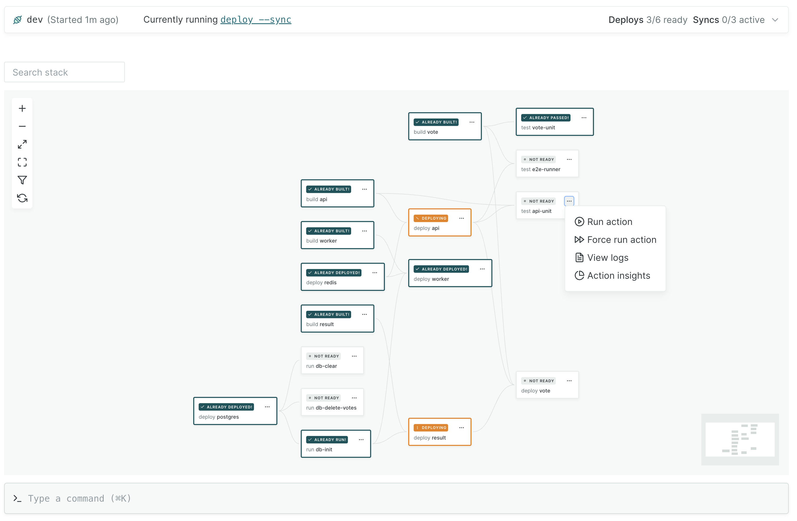
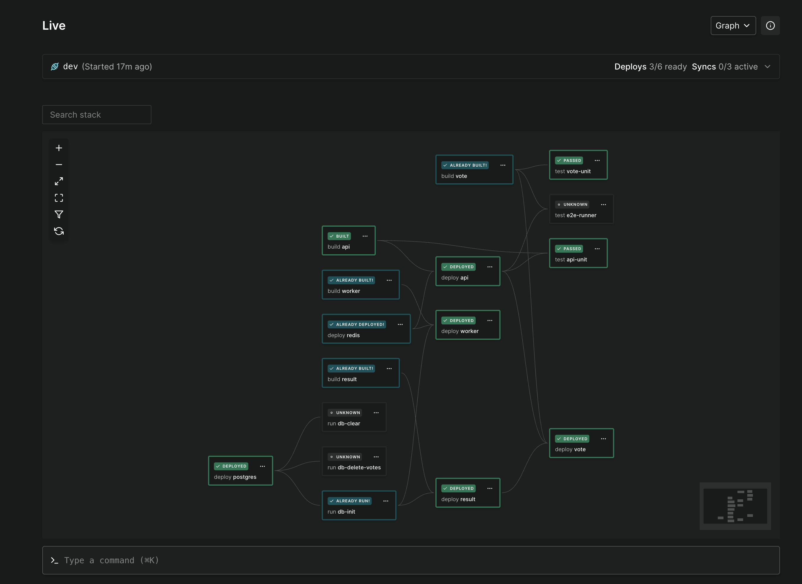

# Dashboard

The [Garden dashboard](https://app.garden.io) is a web app that's available on Garden's free community tier that adds various functionality on top of the Garden CLI.



Key features include:

- [Garden managed ephemeral clusters](../k8s-plugins/ephemeral-k8s/README.md) that you can spin up on demand
- An interactive graph view
- Command history across all your projects
- Action log viewer (e.g. for viewing build logs)
- Command palette for running any Garden command directly from the dashboard
- "Live" logs viewer that lets you stream and interleave logs from both the Garden CLI and your runtime services

The dashboard is under heavy development and we're constantly improving it. Any and all feedback is greatly appreciated via [GitHub issues](https://github.com/garden-io/garden/issues/new?assignees=&labels=cloud+%F0%9F%8C%A9&projects=&template=DASHBOARD_FEEDBACK.md&title=).

## Getting Started

First, go to the [dashboard site](https://app.garden.io/) and sign up if you haven't already.

We currently only support signing up via GitHub but [let us know](https://github.com/garden-io/garden/issues/new?assignees=&labels=cloud+%F0%9F%8C%A9&projects=&template=DASHBOARD_FEEDBACK.md&title=) if you'd like to see other options.

Then run the login command with the Garden CLI from your terminal:

```
garden login
```

And that's it! Next time you run Garden in your project you'll be able to use the dashboard. Projects are created automatically in the dashboard if they don't exist already.

If you're new to Garden, you can also follow the in-app onboarding guide.

## Live Page

From the Live page you can view your project graph, stream logs in real time, and run any Garden command from the command palette.


The Live page is only available when Garden is running in dev mode. To get started, run the following from your terminal:

```
garden dev
```

Then follow the link to the Live page.

### Deploy and sync statuses

You can view the statuses of your Deploy actions and syncs by expanding the command tray at the top of the page. From here you can also start and stop individual syncs.

This is e.g. useful if you're hopping between branches with a lot of changes and want to disable syncing while you do so.

### Logs view

The Logs view streams all logs from the CLI by default. Here you can also change the log level on demand and filter on log lines.

You can also use the "Log sources" dropdown to stream logs from your actual services at runtime (i.e. the logs your applications write to stdout).

### Graph view

The Graph view shows you the graph of all your actions and their statuses. To load the latest statuses you can click the "refresh" button on the left control panel. You can also run individual actions or view their logs by clicking on the nodes.


### Action results

The Action results view shows you a list of actions that have been executed since you started the `garden dev` command. Here you can see their results, view logs and find ingress links for Deploy actions.

You can also see what actions are cached and the time you've saved by using Garden.

### Command palette

You can open the command palette by pressing `cmd+k` on macOS or `ctrl+k` on Windows/Linux. It allows you to run any Garden command from the dashboard itself which is e.g. useful if you want to trigger commands while looking at logs. The command is then executed by the Garden CLI process running your machine.



Currently the Live page will only work on Chromium based browsers (e.g. Chrome, Brave, Ark) because of how it connects to the Garden CLI over a local websocket connection between the browser and the CLI process.

This is a bit embarrassing and we're working hard to fix it :)

Other pages will work as expected.


## Ephemeral clusters

The Garden ephemeral clusters are managed via the dashboard. To get started, checkout [this guide](../k8s-plugins/ephemeral-k8s/README.md).

## Commands

The Commands page shows you a list of historic commands. Both those you've run with the Garden CLI directly (e.g. `garden deploy`) and those you've run from within the dev console. You can click the commands to get a detail view of the command results.

## User Settings

### Dark mode

You can toggle dark/light mode via the user settings which you can access by clicking the Garden logo at the top left.



### Access tokens

Under the user settings you can also create an access token so that you can e.g. connect to the dashboard from CI. The access token is set via the `GARDEN_AUTH_TOKEN` environment variable. For example:

```
GARDEN_AUTH_TOKEN=<my-access-token> garden deploy
```

In an upcoming release we'll be adding functionality for creating proper teams and service accounts for use in CI.

## Want more?

The community dashboard contains a subset of the Garden Enterprise feature set. If you're looking for:

- [Secret management](https://cloud.docs.garden.io/features/secrets)
- [Cloud workflows triggered by VCS events](https://cloud.docs.garden.io/features/workflows)
- [Actionable usage insights](https://cloud.docs.garden.io/features/insights)
- [1-click preview environments](https://cloud.docs.garden.io/features/one-click-preview-environments)
- [Automatic environment cleanup](https://cloud.docs.garden.io/features/automatic-environment-cleanup)
- [User managment and access control](https://cloud.docs.garden.io/features/roles-and-permissions)

...and a lot more—then checkout out our [different plans](https://garden.io/plans) or [book a demo](https://garden.io/contact)!
