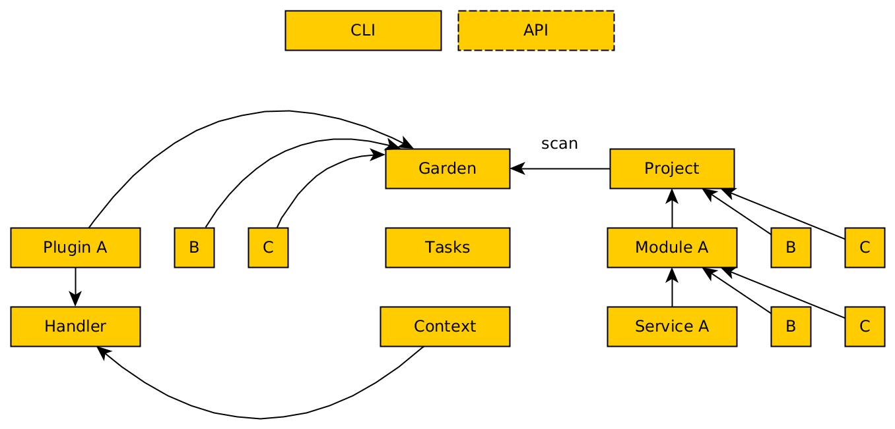

# README.md

This is the source code for the garden framework.

Here's a high-level overview of how the whole thing works:

The main components are plugins, projects, and the framework itself.

### Projects

Projects are your user's files. A project is composed of modules, which are in turn composed of services.

Let's see our [hello-world](https://github.com/garden-io/garden/tree/master/examples/hello-world) example:
    - It has two modules, `hello-container` and `hello-function`.
    - `hello-container` contains one service, named `hello-container`.
    - `hello-function` also contains only one service, named `hello-function`.

Just as you may have many modules per project, you may have many services per module.

Beware that no two services may have the same name in the project. (You could want to, for example, have a `logging` service on multiple modules. In this case you'll need a different name for each.)

### Plugins

Plugins are garden's way of knowing what to do about each module in a project. The way a container behaves is different than a serverless function, for example, and plugins are the way to define those different behaviours.

Plugins interact with the project via the plugin interface. For more detailed information, see the README.md file in the plugin directory. 

### The Framework

In the context of projects and plugins, what the framework does is:

    1. Watch project files for changes
    2. Provide plugins with context so they can operate on the project
    3. Keep track of state as multiple plugins work independently